# Capstone-Project
Capstone Project for Android Nanodegree

## Description 

This is a questions & answers app like a light version of Quora where users can ask questions in different topics, answer questions, follow topics of interest and follow other users.

## Intended User

People who have questions to ask, and people who want to share their wisdom.

## Features

- Users ask questions in one topic
- They get notified when their questions are answered
- Users can follow topics
- Any user can answer a question
- Users upvote their favorite answers
- A user can follow another user
- Users have a basic profile

## User Interface Mocks

### Screen 1 login and sign up
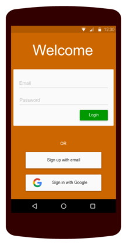
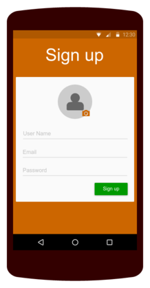

### Screen 2 feed
This is the home page where users can find answers to questions from their favorite topics. From here the user may select to show answer, explore a topic, or ask a question.

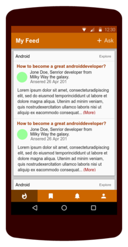

### Screen 3 topic
The user may select to explore a topic where he can find a list of answered questions, or the list of unanswered questions

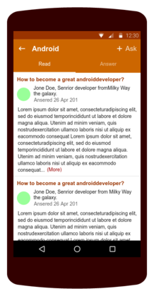
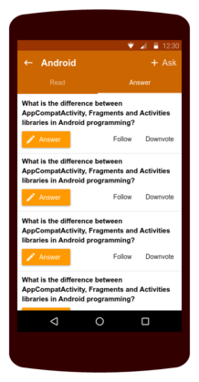

### Screen 4&5 ask and answer
If user selects to ask a question.
If user selects to answer an existing question.

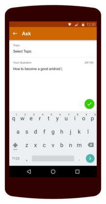
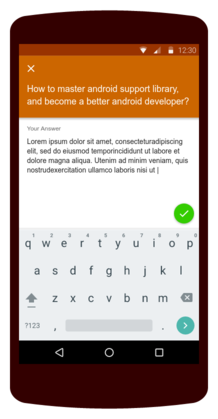

### Screen 6 read answers
If the user clicks to read more details. He is taken to this screen where he can read the full answer and all other answers

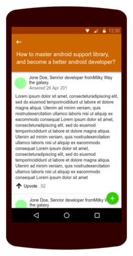

### Screen 7&8 Topics and notifications
The user can find a list of topics to follow and the list of topics he is currently following
The user is notified about answers to his questions

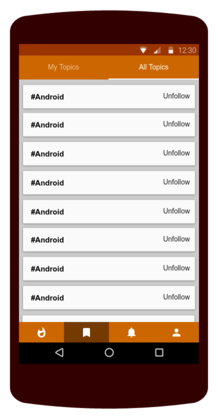
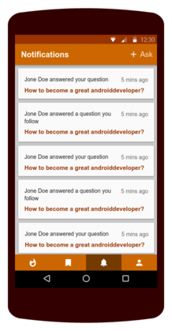

### Screen 9 Profiles
The user can update his picture and account info. And find a list of his answers
When the user click on other users info. He can show their profiles with a list of answers they added. And He can follow them

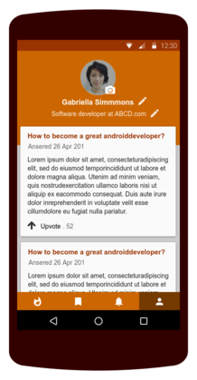
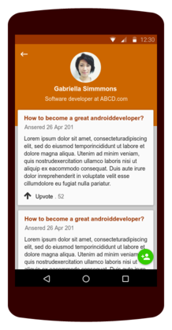

### Screen 10 Widget
The user can add a widget to the home screen where he can find top answers in his favorite topics

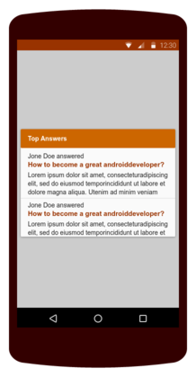

## Key Considerations

### How will your app handle data persistence? 

The data will be saved in firebase realtime database and will be accessed by firebase sdk. Firebase will sync the data between the cloud and user device. Firebase cloud functions will be used to send a notification to the user when his questions receive a new answer. Firebase authentication will be used to insure secure access to data in the cloud.
I will use firebase job dispatcher to schedule a service to fetch the latest updates from the cloud every x hours.
Describe any edge or corner cases in the UX.

### Describe any libraries you’ll be using and share your reasoning for including them.

The app will be written solely in Java programming language. Android studio 3.1.2 will be used for development, and its default gradle version is 4.4
I will target API version 27 and will use minSdkVersion of 19 and may adjust it to 21 if I needed to add advanced features later. I will use android support library v27.1.1
I will use glide library v4.7.1 for handling image loading and caching, timber v4.7.0 for logging. Also I will use android architecture components v1.0 stable.
I will use firebase jobdispatcher v0.8.5 for scheduling service

### Describe how you will implement Google Play Services or other external services.

The app will use admob to show ads. It will use identity to allow user to sign in with their google account.

## Next Steps: Required Tasks

This is the section where you can take the main features of your app (declared above) and break them down into tangible technical tasks that you can complete one at a time until you have a finished app.

### Task 1: Project Setup

- Create a firebase project and enable login with gmail and set up a realtime database.
- Create new android project
- Add the dependencies for required support libraries, firebase, Timber and Glide

### Task 2: Design data model & implement Login

- Design the data model
- Insert some data in the realtime database to work on
- Implement login & signup flow

### Task 3: Implement the UI

- Implement profile screen where the user can update their data
- Implement topic screen
- Implement ask question screen
- Implement write answer screen
- Implement feed screen
- Implement data sync with firebase job dispatcher
